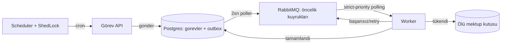

# Görev Motoru

**Resilient, observable async task engine for Spring Boot** — Postgres + RabbitMQ üzerine
kurulu, genel amaçlı bir iş kuyruğu motoru. Celery/Sidekiq/BullMQ'nun Java/Spring
ekosistemindeki karşılığı gibi düşünülebilir: retry+backoff, ölü mektup kutusu (DLQ),
idempotency, öncelik kuyrukları, zamanlanmış (cron) görevler, işbirlikçi iptal, dağıtık
izleme (trace id), Micrometer metrikleri ve JWT korumalı bir REST API + dashboard ile
gelir.

## Özellikler

- **Transactional outbox** — görev + outbox kaydı aynı transaction'da yazılır; uygulama
  outbox yazıldıktan hemen sonra beklenmedik şekilde sonlansa bile görev kaybolmaz, kalıcı
  kaydından başka bir instance tarafından devralınır.
- **Retry + exponential backoff + jitter** — RabbitMQ'nun delayed-message plugin'i üzerinden,
  ayrı bir "gecikme" alt sistemi olmadan mevcut outbox'a entegre.
- **İki katmanlı idempotency** — gönderimde UNIQUE+dedup, worker'da tekrar-teslimat guard'ı.
- **Ölü mektup kutusu (DLQ)** — iş mantığı hataları uygulama seviyesinde, zehirli/deserialize
  edilemeyen mesajlar native RabbitMQ DLX ile, ayrı ayrı ele alınır.
- **Öncelik kuyrukları** — 3 fiziksel kuyruk + özel strict-priority polling tüketici (push-model
  `@RabbitListener`'ın veremeyeceği kesin sıralama garantisi).
- **Zamanlanmış (cron) görevler** — ShedLock ile çoklu-instance'ta tek çalıştırma garantisi.
- **İşbirlikçi iptal** — API hangi worker instance'ının görevi çalıştırdığını bilmeden, DB
  üzerinden (optimistik kilitle korunan) bir sinyalle çalışır.
- **Uçtan uca trace id** — HTTP isteğinden worker/handler loguna kadar tek bir korelasyon id'si
  (Micrometer Tracing + MDC), yapısal JSON log.
- **Micrometer metrikleri** — kuyruk derinliği, işleme süresi (p50/p95), başarı/hata/retry
  sayaçları, Prometheus endpoint.
- **JWT korumalı REST API + statik dashboard** — görev listesi/filtre, deneme geçmişi, DLQ
  yönetimi, canlı metrik paneli.
- **Testcontainers entegrasyon testleri** — gerçek Postgres + RabbitMQ container'larıyla
  retry/DLQ/idempotency/iptal senaryoları.
- **Spring Boot auto-configuration starter** olarak paketlenmiş — herhangi bir Spring Boot
  uygulamasına bağımlılık olarak eklenip `@GorevTipi` + `GorevHandler` ile yeni görev tipleri
  tanımlanabilir.

## Mimari



3 modül:
- `motor-cekirdek` — framework'ten bağımsız çekirdek arayüzler (`GorevHandler`, `GorevGonderici`, ...)
- `motor-spring-starter` — gerçek implementasyon, Spring Boot auto-configuration starter'ı
- `motor-api` — çalıştırılabilir kabuk: REST API, JWT güvenlik, dashboard, örnek handler'lar

Detaylı kullanım kılavuzu: [`motor-spring-starter/README-motor.md`](motor-spring-starter/README-motor.md).
Mimari kararlar: [`docs/adr/`](docs/adr/).

## Teknoloji yığını

Java 21 · Spring Boot 3.5.16 · PostgreSQL 16 · RabbitMQ 3.13 (delayed-message plugin) ·
ShedLock · Micrometer (Tracing/Brave + Prometheus) · jjwt · Testcontainers + Awaitility

## Hızlı başlangıç

```bash
cp .env.example .env
docker compose up -d postgres rabbitmq

# tüm demo senaryolarını tetikleyen profil:
mvn -pl motor-api spring-boot:run -Dspring-boot.run.profiles=worker,demo
```

Dashboard: `http://localhost:8080/dashboard/index.html` (veya `worker,demo` tek profilde 8090).

Entegrasyon testleri (Docker gerekli):
```bash
mvn -pl motor-api -am test -Dtest=GorevMotoruEntegrasyonTestleri
```

## Bilinen sınırlamalar

- Gerçek bir domain/iş mantığı içermiyor — depoda yalnızca motorun davranışını gösteren 3
  örnek handler (`ornek.echo/bekle/hata-ver`) bulunuyor; gerçek görev tipleri tüketici
  uygulama tarafından yazılır.
- Exactly-once semantiği yok (at-least-once + idempotency ile yaklaşılıyor), multi-tenancy/RBAC
  yok, dağıtık izleme toplayıcısı (Jaeger/Zipkin) yok — trace id MDC/JSON log seviyesinde kalıyor.
